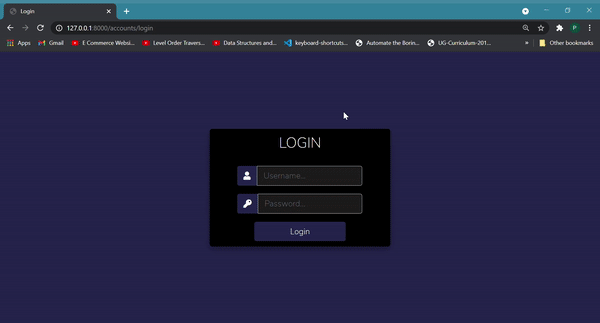
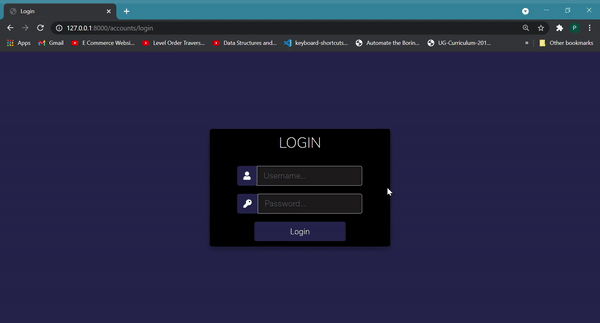

# Django Inventory Management System
College Clubs have resources that can be borrowed by any of its members upon request. Members can borrow resources when
approved by the convener of the club.
Three roles exist namely, Admin, Convenor and Member. Different users have access to only specific functions.
<h3>Admin Demo</h3>

<h3>Convenor Demo</h3>

<h3>Member Demo</h3>

<h3>To add new user to club</h3>

<h3>Installing and using a Virtual Environment</h3>

`pip install virtualenvwrapper-win` 
`mkvirtualenv test` &nbsp; _test = name of virtual env_

<h3>Install required packages:</h3>

`pip install Django` 

<h3>To run project:</h3>

`pip install -r requirements.txt` 
_After ensuring that we are in a virtual environment (If not, use `workon test`)_

`python manage.py makemigrations`  
`python manage.py migrate`  
`python manage.py runserver` 

<h3>Create Super user:</h3>

`python manage.py createsuperuser`

Enter desired credentials

<h3>Admin Site:</h3>

http://127.0.0.1:8000/admin

<h3>Implemented Features</h3>
<ul>
    <li>Member
        <ul>
            <li>View club items</li>
            <li>Request for items</li>
            <li>View request status</li>
        </ul>
    </li>
    <li>Convenor
        <ul>
            <li>View all members of club</li>
            <li>View club items</li>
            <li>Add, Update items</li>
            <li>View member requests</li>
            <li>Approve/Reject requests</li>
            <li>Validation of quantity of requested item</li>
        </ul>
    </li>
    <li>Admin
        <ul>
            <li>View all clubs, users, items and requests</li>
            <li>Add new club</li>
            <li>Add, Update items</li>
        </ul>
    </li>
    <li>Authentication and page restrictions</li>
</ul>
<h3>Planned Features</h3>
<ul>
    <li>Email respective users about requests</li>
    <li>Add,remove user(s) directly without using the Django admin panel</li>
</ul>
<h3>Known Bugs</h3>
<ul>
    <li>Each user can be a part of many clubs but details of only one are displayed</li>
</ul>

<h3>References:</h3>
<a href="https://docs.djangoproject.com/en/3.2/">Django's Official Documentation</a> 
<a href="https://www.youtube.com/watch?v=tUqUdu0Sjyc&list=PL-51WBLyFTg2vW-_6XBoUpE7vpmoR3ztO&index=15">Dennis Ivy
    Youtube</a> 
<a href="https://www.youtube.com/watch?v=yyBF-2SXXOc&t=690s">Super Coders Youtube</a> 
<a href="https://stackoverflow.com/">Stack Overflow</a> 